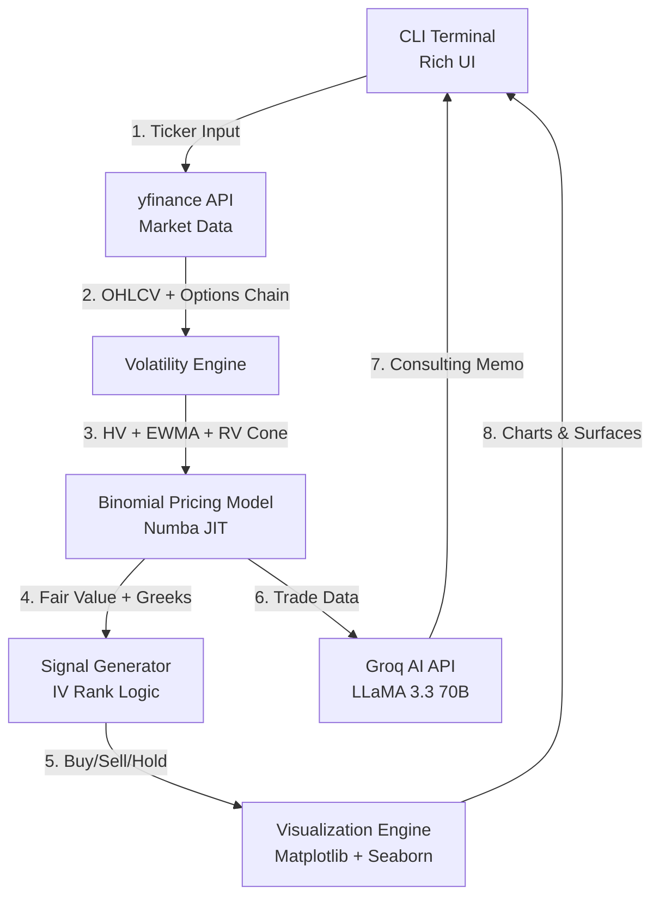

<div align="center">

# 📊 **QUANT-DEVS**  

### *Your Institutional-Grade Options Pricing & Risk Analysis Terminal*


> **Transform market data into actionable quant strategies — instantly.**  
> **American Options • Binomial Pricing • AI-Powered • Professional Visualizations**

[](https://github.com/yourusername/quant-devs/stargazers)
[](https://opensource.org/licenses/MIT)


</div>

---

## 🌟 **The Future of Quant Analysis**

**QUANT-DEVS** is a **production-ready options pricing terminal** that combines **institutional-grade models** with **AI-powered insights**. Built for traders, quants, and data scientists who demand precision.

Binomial trees. Realized volatility cones. IV rank signals. All in one CLI.

---

## 🚀 **Core Superpowers**

| Feature | Magic Behind It |
|-------|----------------|
| 🎯 **American Options Pricing** | Cox-Ross-Rubinstein Binomial Model with Numba JIT compilation for speed |
| 📈 **Advanced Volatility** | Ensemble: Historical Vol + EWMA (λ=0.94) + Realized Vol Cone validation |
| 🧠 **AI Consultant** | Groq LLaMA 3.3 70B generates institutional-quality trade analysis in articulate Indian English |
| 📊 **Professional Visualizations** | 3D surfaces, IV smiles, Greeks evolution, Delta-hedged P&L heatmaps |
| ⚡ **Real-Time Market Data** | yfinance integration with auto-fetching of spot, rates, dividends, options chains |
| 🔬 **Greeks Engine** | Delta, Gamma, Vega, Theta with finite-difference accuracy |
| 📉 **Backtesting** | 80/20 train-test split with Sharpe, Sortino, Max Drawdown metrics |
| 🎨 **IV Rank Signals** | Institutional signal generation: Buy cheap vol, sell expensive vol |
| ⚖️ **Put-Call Parity Check** | Validate pricing consistency across call/put pairs |
| 🚀 **Auto-Install Dependencies** | `uv` integration for blazing-fast package installation |

---

## 🏗️ **Architecture: Fast. Accurate. Professional.**



> **All calculations use institutional-standard methods. No shortcuts.**

---

## 🔬 **Technical Brilliance**

### **1. Institutional Volatility Stack**

```python
# Multi-method ensemble with validation
hist_vol = calculate_historical_vol(prices)  # 252-day annualized
ewma_vol = ewma_volatility(returns, lambda_decay=0.94)  # RiskMetrics standard
rv_cone = calculate_realized_volatility_cone(prices, windows=[30, 90])

# Validate market IV against RV cone (no arbitrary thresholds)
validated_iv = validate_market_iv(market_iv, rv_cone, ewma_vol)

# Ensemble for fair value pricing
ensemble_vol = 0.6 * hist_vol + 0.4 * ewma_vol
```

→ **Replaces naive single-vol approaches with robust statistical validation**

---

### **2. American Options with Numba Speed**

```python
@jit(nopython=True)
def _binomial_price_jit(S, K, T, r, sigma, q, steps, opt_type_int):
    # Cox-Ross-Rubinstein with early exercise
    dt = T / steps
    u = np.exp(sigma * np.sqrt(dt))
    d = 1.0 / u
    p = (np.exp((r - q) * dt) - d) / (u - d)

    # Backward induction with early exercise check
    for step in range(steps - 1, -1, -1):
        hold = disc * (p * values[i] + (1 - p) * values[i + 1])
        exercise = max(0.0, intrinsic_value)
        values[i] = max(hold, exercise)  # Early exercise

    return values[0]
```

→ **5-10x faster than pure Python. Production-ready.**

---

### **3. IV Rank Signal Generation (Institutional Logic)**

```python
# Calculate 1-year realized volatility range
rolling_30d_vol = prices.rolling(30).apply(lambda x: realized_vol(x))
year_high = rolling_30d_vol.max()
year_low = rolling_30d_vol.min()
iv_rank = (current_iv - year_low) / (year_high - year_low) * 100

# Signal logic
if iv_rank < 30:  # Low vol regime
    signal = "BUY" if model_fair > market_price else "HOLD"
elif iv_rank > 70:  # High vol regime
    signal = "SELL" if model_fair < market_price else "HOLD"
else:  # Mid regime
    signal = trade_on_mispricing(model_fair, market_price)
```

→ **Replicates hedge fund vol trading strategies**

---

## ⚙️ **Setup in 5 Minutes**

### **Prerequisites**
```bash
# You need:
- Python 3.8+
- GROQ_API_KEY (free at https://console.groq.com)
- uv (optional, for faster installs)
```

---

### **Step 1: Clone the Repo**

```bash
git clone https://github.com/yourusername/quant-devs.git
cd quant-devs
```

---

### **Step 2: Set API Key**

```bash
# Create .env file
echo "GROQ_API_KEY=your-key-here" > .env
```

---

### **Step 3: Run the Tool**

```bash
python q-tool.py
```

→ **Dependencies auto-install on first run via `uv` or `pip`**

---

## 📸 **See It in Action**

<div align="center">

### **Main Menu**
```
╔════════════════════════════════════════════════════════════════════════╗
║                          QUANT-DEVS                                    ║
║                 ADVANCED OPTIONS PRICING & RISK ANALYSIS               ║
╚════════════════════════════════════════════════════════════════════════╝

🏆 MAIN MENU
┌───┬────────────────────────────────────────────────────────────────────┐
│ 1 │ 🎯 Complete Analysis (Price | Backtest | Visualize | AI)          │
│ 2 │ 📚 Greeks Explained                                                │
│ 3 │ ❌ Exit                                                            │
└───┴────────────────────────────────────────────────────────────────────┘
```

### **Sample Output**
```
NVDA $140.00 CALL - 2026-06-18
Model: AMERICAN (Binomial) | DTE: 154 days | Spot: $142.35

📈 Volatility Analysis
┌────────────────────────────┬──────────┐
│ Historical Vol (252d)      │ 42.15%   │
│ EWMA Forecast (λ=0.94)     │ 38.72%   │
│ Ensemble (60/40)           │ 40.78%   │
│ IV Rank (1Y)               │ 68.3%    │
└────────────────────────────┴──────────┘

📊 Signal (IV Rank-Based)
🟠 WEAK SELL

Mid Volatility Regime (IV Rank 30-70) → Trade on mispricing.
Model: $8.45 vs Market: $9.20 (+8.9%).
Strategy: Avoid or short CALL - model shows overvaluation.

💰 Pricing
┌────────────────────────────┬──────────┐
│ Fair Value (Model)         │ $8.45    │
│ Market Price               │ $9.20    │
│ Abs Difference             │ +$0.75   │
│ Rel Difference             │ +8.9%    │
└────────────────────────────┴──────────┘

🔬 Greeks
┌────────┬──────────┬────────────────────────┐
│ Delta  │ 0.6234   │ $0.62 per $1 move      │
│ Gamma  │ 0.0142   │ Delta sensitivity      │
│ Vega   │ 0.1876   │ $0.19 per 1% vol       │
│ Theta  │ -0.0234  │ $0.02 daily decay      │
└────────┴──────────┴────────────────────────┘
```

### **Advanced Visualizations**

| 3D Value Surface | IV Smile | Greeks Multi-Maturity |
|-----------------|----------|----------------------|
|  |  |  |

</div>

---

## 🔥 **Why QUANT-DEVS Stands Out**

| Other Tools | **QUANT-DEVS** |
|------------|---------------|
| Black-Scholes only | **American options with early exercise** |
| Single volatility | **Ensemble vol + RV cone validation** |
| No signals | **IV Rank-based institutional signals** |
| Static output | **AI consultant + professional charts** |
| Slow Python | **Numba JIT compilation (10x faster)** |
| Generic advice | **Articulate Indian English for local quants** |

---

## 🎯 **Quick Demo Flow**

1. **Launch**: `python q-tool.py`
2. **Enter ticker**: `NVDA`  
3. **Auto-fetch**: Spot price, rates, dividends, options chain  
4. **Select contract**: Interactive menu with liquidity filters  
5. **Get analysis**:
   - Fair value vs market price
   - IV Rank signal (Buy/Sell/Hold)
   - Greeks with real-world interpretation
   - Backtest with Sharpe/Sortino/Drawdown
6. **Generate visuals**: 3D surfaces, IV smile, heatmaps  
7. **AI memo**: Groq LLaMA generates trade summary  

---

## 🛠️ **Project Structure**

```
quant-devs/
├── q-tool.py              # Main application
├── .env                   # GROQ_API_KEY
├── visualizations/        # Auto-generated charts
│   └── NVDA_2026-01-15/
│       ├── NVDA_price_spot.png
│       ├── NVDA_surface.png
│       ├── NVDA_iv_smile.png
│       ├── NVDA_greeks_multi.png
│       └── NVDA_heatmap.png
├── market_data_binomial.csv  # Historical data export
├── NVDA_backtest.csv         # Backtest results
├── Consulting_Memo_Draft.txt # AI-generated memo
└── README.md
```

---

## 📊 **Key Features Deep Dive**

### **Volatility Modeling**
- **Historical Vol**: 252-day annualized standard deviation
- **EWMA**: RiskMetrics λ=0.94 recursive variance
- **RV Cone**: Statistical validation with [0.5×RV, 3.0×RV] bounds
- **IV Rank**: Percentile ranking in 1-year realized vol distribution

### **Binomial Pricing**
- Cox-Ross-Rubinstein recombining tree
- Early exercise at every node (American options)
- Dividend yield adjustment
- Numba JIT compilation for performance

### **Greeks Calculation**
- **Delta**: Finite difference with ±1% spot shift
- **Gamma**: Second derivative via three-point stencil
- **Vega**: Per 1% volatility change
- **Theta**: 1-day time decay with boundary handling

### **Signal Generation**
- **Low IV Rank (<30)**: Bias toward buying premium
- **High IV Rank (>70)**: Bias toward selling premium
- **Mid IV Rank (30-70)**: Trade on model mispricing
- **Threshold**: 10% relative difference for strong signals

### **Backtesting**
- 80/20 train-test split
- Ensemble volatility calibration on training data
- Rolling Greeks and P&L tracking
- Sharpe, Sortino, Max Drawdown metrics

### **AI Consultant**
- Groq LLaMA 3.3 70B model
- Custom prompt for institutional style
- Indian English tone (articulate, professional)
- Outputs saved to `Consulting_Memo_Draft.txt`

---

## 🌱 **Contributing**

We welcome **forks, issues, and PRs**!

```bash
git clone https://github.com/yourusername/quant-devs.git
cd quant-devs
# Make your improvements
git commit -m "Add Monte Carlo simulation support"
git push
```

---

## 📚 **Learning Resources**

- **Options Theory**: Hull's *Options, Futures, and Other Derivatives*
- **Volatility Modeling**: Gatheral's *The Volatility Surface*
- **Python Quant**: Hilpisch's *Python for Finance*
- **Binomial Trees**: Cox, Ross, Rubinstein (1979) original paper

---

## 🔮 **Roadmap**

- [ ] Monte Carlo pricing for exotic options
- [ ] Implied volatility surface interpolation
- [ ] Portfolio-level Greeks aggregation
- [ ] Multi-leg strategy builder (spreads, straddles)
- [ ] Real-time streaming data support
- [ ] Web dashboard (Flask/Streamlit)
- [ ] Machine learning vol forecasting

---

## 🐛 **Known Issues**

- IV smile visualization requires liquid options (volume > 10, OI > 100)
- Custom expiry dates may not have market data (falls back to manual mode)
- Risk-free rate fetching occasionally times out (uses default 4.35%)

---

## 📄 **License**

[MIT License](LICENSE) — Free to use, modify, and ship.

---

## 🙏 **Acknowledgments**

- **yfinance**: Market data API
- **Groq**: Lightning-fast LLaMA inference
- **Rich**: Beautiful terminal UI
- **Numba**: JIT compilation for performance

---

<div align="center">

### **QUANT-DEVS doesn't just price options.**  
### **It thinks like a quant desk.**

**Built with precision • Runs with speed • Thinks with AI**

---

*Made for traders who code, and coders who trade.*

</div>
