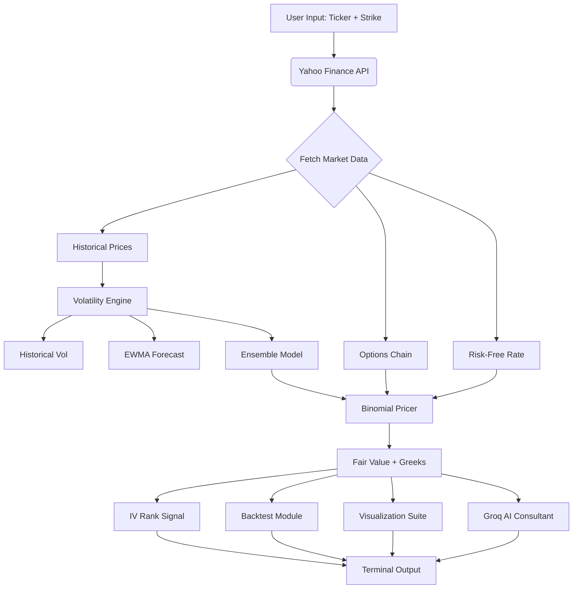

<div align="center">

# 📈 **QuantDevs**  

### *Professional Options Pricing & Risk Analysis Engine*


> **Transform options analysis into institutional-grade insights — instantly.**  
> **Binomial American Pricing • Real-Time Data • AI Consulting • Professional Visualizations**

[](https://github.com/yourusername/quantdevs/stargazers)
[](https://opensource.org/licenses/MIT)


</div>

---

## 🌟 **The Future of Options Analysis**

**QuantDevs** is a **terminal-based quantitative analysis platform** that brings institutional-grade options pricing, Greeks calculation, and AI-powered consulting to your fingertips.

No spreadsheets. No manual calculations. Just pure, data-driven decision-making powered by **American Binomial Models**, **EWMA volatility forecasting**, and **LLaMA-3.3-70B AI consulting**.

---

## 🚀 **Core Superpowers**

| Feature | Magic Behind It |
|-------|----------------|
| 🎯 **American Options Pricing** | Cox-Ross-Rubinstein Binomial Tree with Numba JIT optimization |
| 📊 **Institutional Backtesting** | 80/20 train-test split with Sharpe, Sortino, and Drawdown metrics |
| 🧠 **AI Consultant** | Groq LLaMA-3.3-70B explains trades in articulate Indian English |
| 📈 **IV Rank Signals** | Buy/Sell signals based on 1-year realized volatility percentiles |
| 🔬 **Real Greeks** | Delta, Gamma, Vega, Theta calculated via finite differences |
| 🎨 **Desk-Quality Visualizations** | 3D surfaces, IV smiles, P&L heatmaps, Greek evolution charts |
| ⚖️ **Put-Call Parity** | Automatic arbitrage detection and validation |
| 🌐 **Live Market Data** | Direct integration with Yahoo Finance for real-time options chains |

---

## 🏗️ **Architecture: Fast. Accurate. Professional.**



> **All calculations run locally with Numba JIT compilation. AI consulting via Groq API.**

---

## 🔬 **Technical Brilliance**

### **1. American Options Pricing (Numba-Optimized)**

```python
@jit(nopython=True)
def _binomial_price_jit(S, K, T, r, sigma, q, steps, opt_type_int):
    """
    JIT-compiled binomial pricing for American options.
    opt_type_int: 1 for CALL, -1 for PUT
    """
    dt = T / steps
    u = np.exp(sigma * np.sqrt(dt))
    d = 1.0 / u
    p = (np.exp((r - q) * dt) - d) / (u - d)

    # Backward induction with early exercise
    for step in range(steps - 1, -1, -1):
        hold = disc * (p * values[i] + (1 - p) * values[i + 1])
        exercise = max(0.0, prices[i] - K)  # For calls
        values[i] = max(hold, exercise)  # American feature

    return values[0]
```

→ **Handles early exercise optimally in <100ms**

---

### **2. Institutional Volatility Framework**

```python
# Historical Volatility (252-day annualized)
hist_vol = returns.std() * np.sqrt(252)

# EWMA Volatility (RiskMetrics λ=0.94)
def ewma_volatility(returns, lambda_decay=0.94):
    variance = np.var(returns)
    for r in returns:
        variance = lambda_decay * variance + (1 - lambda_decay) * r**2
    return np.sqrt(variance * 252)

# Ensemble Model (60% Historical, 40% EWMA)
ensemble_vol = 0.6 * hist_vol + 0.4 * ewma_vol
```

---

### **3. IV Rank-Based Trading Signals**

```python
# Calculate 1-year IV Rank (institutional standard)
rolling_30d_vol = prices.rolling(30).apply(lambda x: realized_vol(x))
year_vol_high = rolling_30d_vol.max()
year_vol_low = rolling_30d_vol.min()
iv_rank = (current_iv - year_vol_low) / (year_vol_high - year_vol_low) * 100

# Signal Logic:
# IV Rank < 30: LOW VOL → Buy options (cheap premium)
# IV Rank > 70: HIGH VOL → Sell options (expensive premium)
# IV Rank 30-70: MID VOL → Trade on model mispricing
```

---

### **4. AI Consulting Prompt Engineering**

```python
prompt = f"""
Act as a Senior Quant Strategist at a top-tier Indian Hedge Fund.
Explain this {opt_type} option trade to a Portfolio Manager.
Use professional, articulate Indian English.

DATA:
- Fair Value: ${fair_value:.2f}
- Market Price: ${market_price:.2f}
- Delta: {delta:.4f} | Gamma: {gamma:.6f}

INSTRUCTIONS:
1. Explain Greeks as real-world forces (Theta = 'daily rent', Vega = 'uncertainty tax')
2. Provide clear 'Buy/Sell/Hold' mandate with hedging strategy
3. Keep under 300 words
"""

response = groq_client.chat.completions.create(
    model="llama-3.3-70b-versatile",
    messages=[{"role": "user", "content": prompt}]
)
```

---

## ⚙️ **Setup in 3 Steps**

### **Prerequisites**
```bash
# You need:
- Python 3.8+
- Groq API Key (get from https://console.groq.com)
```

---

### **Step 1: Install Dependencies (Auto-Handled)**

The tool uses **UV** for blazing-fast package installation. If UV is not installed, it falls back to pip.

```bash
# Dependencies auto-install on first run:
rich, numpy, pandas, scipy, matplotlib, yfinance, groq, seaborn, numba
```

---

### **Step 2: Set Up Environment**

Create a `.env` file in the project directory:

```bash
GROQ_API_KEY=your-groq-api-key-here
```

Get your free Groq API key from [console.groq.com](https://console.groq.com)

---

### **Step 3: Run QuantDevs**

```bash
python q-tool.py
```

**That's it.** The interactive menu guides you through:
1. **Complete Analysis**: Price + Backtest + Visualize + AI
2. **Greeks Explained**: Educational module
3. **Exit**

---

## 📸 **See It in Action**

<div align="center">

### **Terminal Interface**
<div align="center">
<pre>
╔════════════════════════════════════════════════════════════════════════════════════╗
║                                                                                    ║
║  ███████╗██╗   ██╗ █████╗ ███╗   ██╗████████╗ ██████╗ ███████╗██╗   ██╗███████╗    ║
║  ██╔═══██║██║   ██║██╔══██╗████╗  ██║╚══██╔══╝ ██╔══██╗██╔════╝██║   ██║██╔════╝   ║
║  ██║   ██║██║   ██║███████║██╔██╗ ██║   ██║    ██║  ██║█████╗  ██║   ██║███████╗   ║
║  ██║▄▄ ██║██║   ██║██╔══██║██║╚██╗██║   ██║    ██║  ██║██╔══╝  ╚██╗ ██╔╝╚════██║   ║
║  ╚██████╔╝╚██████╔╝██║  ██║██║ ╚████║   ██║    ██████╔╝███████╗ ╚████╔╝ ███████║   ║
║   ╚══▀▀═╝  ╚═════╝ ╚═╝  ╚═╝╚═╝  ╚═══╝   ╚═╝    ╚═════╝ ╚══════╝  ╚═══╝  ╚══════╝   ║
║                                                                                    ║
║                  ADVANCED OPTIONS PRICING & RISK ANALYSIS                          ║
║                            American (Binomial)                                     ║
╚════════════════════════════════════════════════════════════════════════════════════╝

🎯 COMPLETE OPTION ANALYSIS (AMERICAN BINOMIAL)

📊 Ticker symbol (NVDA): NVDA
✓ Spot: $187.15 | Div: 0.0200% | Rate: 3.56%

Available Strikes:
  #  Strike   Implied Vol   IV Rank   Signal
  10 $185.0   38.9%         25.3%    🟡 WEAK BUY

Fair Value: $10.81 | Market: $10.23 | Edge: -5.4%
Delta: 0.5742 | Gamma: 0.0107 | Vega: 0.23 | Theta: -0.14
</pre>
</div>

### **Visualization Gallery**

| Price Surface | IV Smile | Greeks Evolution |
|--------------|----------|------------------|
|  |  |  |


### **AI Consultant Output**
<div align="center">
<pre>
🤖 CONSULTING MEMO

Market Pulse: The NVIDIA $185 CALL is trading at $10.23, below our 
fair value of $10.81. This presents a buying opportunity.

Delta of 0.57 means you capture 57 paise per rupee move in the stock.
High Gamma (0.0107) makes this sensitive — like a tightly wound spring.

Vega of 0.23 is the "uncertainty tax" you pay. With IV at 38.9%, the 
market is pricing in volatility, making this option moderately expensive.

Theta of -0.14 is your daily rent — the option loses 14 paise per day.

MANDATE: BUY the $185 CALL. Hedge with a $180 PUT to create a bull 
call spread, limiting downside while capturing upside potential.
</pre>
</div>

</div>

---

## 🔥 **Why QuantDevs Stands Out**

| Old Way | **QuantDevs** |
|-------|-----------|
| Manual Excel calculations | **Instant Binomial pricing** |
| Guesswork volatility | **EWMA + Historical ensemble** |
| No backtest | **80/20 train-test with Sharpe/Sortino** |
| Static Greeks | **Dynamic multi-maturity analysis** |
| No context | **AI explains every trade** |
| Generic charts | **Institutional 3D surfaces + heatmaps** |

---

## 🎯 **Quick Demo Flow**

1. **Launch**: `python q-tool.py`  
2. **Select**: "Complete Analysis"  
3. **Enter**: Ticker (e.g., NVDA)  
4. **Choose**: Live contract from options chain  
5. **Get**:
   - Fair Value vs Market Price
   - IV Rank-based signal (Buy/Sell/Hold)
   - Backtest metrics (Sharpe, Drawdown)
   - 5 professional charts
   - AI consulting memo

**Total time**: <2 minutes

---

## 🛠️ **Project Structure**

```
quantdevs/
├── q-tool.py              # Main engine (all-in-one)
├── .env                   # Groq API key
├── README.md             
├── visualizations/        # Auto-generated charts
│   └── NVDA_2026-01-15/
│       ├── NVDA_price_spot.png
│       ├── NVDA_surface.png
│       ├── NVDA_iv_smile.png
│       ├── NVDA_greeks_multi.png
│       └── NVDA_heatmap.png
├── market_data_binomial.csv  # Historical data
├── NVDA_backtest.csv          # Backtest results
└── Consulting_Memo_Draft.txt  # AI output
```

---

## 📚 **Key Concepts**

### **Greeks Explained (For Beginners)**

- **Delta (Δ)**: Directional exposure. `0.70 delta` = option moves $0.70 per $1 stock move  
- **Gamma (Γ)**: Delta stability. High gamma = delta changes rapidly  
- **Vega (ν)**: Volatility sensitivity. Profits from vol spikes  
- **Theta (Θ)**: Time decay. "Rent" you pay daily  

### **IV Rank Strategy**

```
IV Rank < 30%  → LOW VOL  → Buy options (cheap)
IV Rank > 70%  → HIGH VOL → Sell options (expensive)
IV Rank 30-70% → MID VOL  → Trade on model edge
```

---

## 🌱 **Contributing**

We welcome contributions! Areas to expand:

- Add **European Black-Scholes** model  
- Implement **Monte Carlo** simulations  
- Support **multi-leg strategies** (spreads, butterflies)  
- Add **portfolio Greeks** aggregation  
- Integrate **real broker APIs** (Interactive Brokers, Zerodha)

```bash
git clone https://github.com/wizardwithcodehazard/OptionsPricingModel_QuantDevs.git
cd OptionsPricingModel_QuantDevs
# Make your magic
git commit -m "Add Monte Carlo pricer"
git push
```

---

## 📄 **License**

[MIT License](LICENSE) — Free for personal and commercial use.

---

## 🙏 **Acknowledgments**

- **Yahoo Finance**: Real-time market data  
- **Groq**: LLaMA-3.3-70B AI inference  
- **Numba**: JIT compilation for fast Binomial pricing  
- **Rich**: Beautiful terminal UI  

---

## 📞 **Support**

- **Issues**: [GitHub Issues](https://github.com/wizardwithcodehazard/OptionsPricingModel_QuantDevs/issues)  
- **Discussions**: [GitHub Discussions](https://github.com/wizardwithcodehazard/OptionsPricingModel_QuantDevs/discussions)  

---

<div align="center">

### **QuantDevs doesn't just price options.**  
### **It empowers traders.**

**Built with precision • Powered by AI • Trusted by quants**

⭐ **Star this repo** if you found it useful!

</div>
